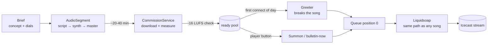
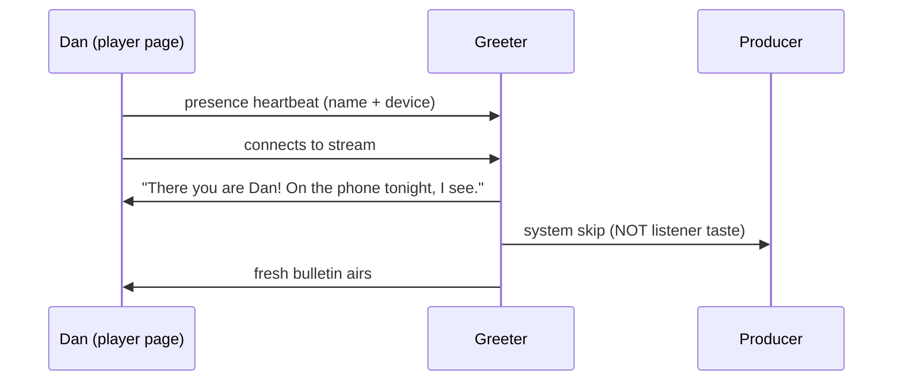

House rule, now applied to the journal itself: **Dan never reads repo files.**
For me a file is one tool call; for him it's FTP, password managers and VPNs.
So this journal is served at `/journal`: a table of every entry (date, title,
author), and entries that can carry full markdown — fenced code, tables, and
live Mermaid diagrams. The running log (`doc/journal.md`) is parsed into
entries automatically, so all history back to February is in the table without
rewriting a line; richer pieces like this one are standalone files with
frontmatter in `doc/journal/`.

## Proof the machinery works: the programme pipeline

This is the actual path an episode travels, from wish to air:



And the arrival flow that wraps it:



## Why the parsing is shaped this way

The log entries derive their titles from the first sentence — which quietly
enforces a good habit: the first sentence of every journal entry should *be*
the headline. Example of the per-track gain line all audio rides on:

```python
uri = f'annotate:replay_gain="{gain_db:.2f} dB":{container_path}'
# The dB suffix is mandatory — a bare float is a LINEAR factor to
# Liquidsoap, and "-5.00" once aired as 5x gain, phase-inverted.
```

| Surface | Where | What it's for |
|---|---|---|
| `/player` | phone + desktop | listening, identity, all listener actions |
| `/settings` | phone + desktop | every knob, live-applied, persisted |
| `/journal` | you are here | what was built, when, and why |
| `/design/gta` | as needed | design briefs I need answered |
